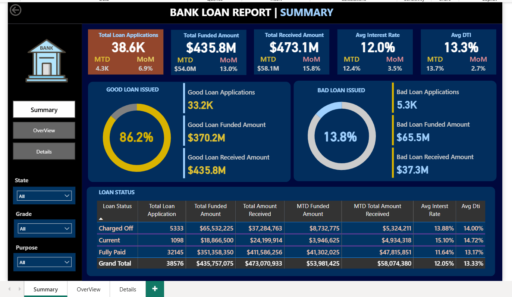
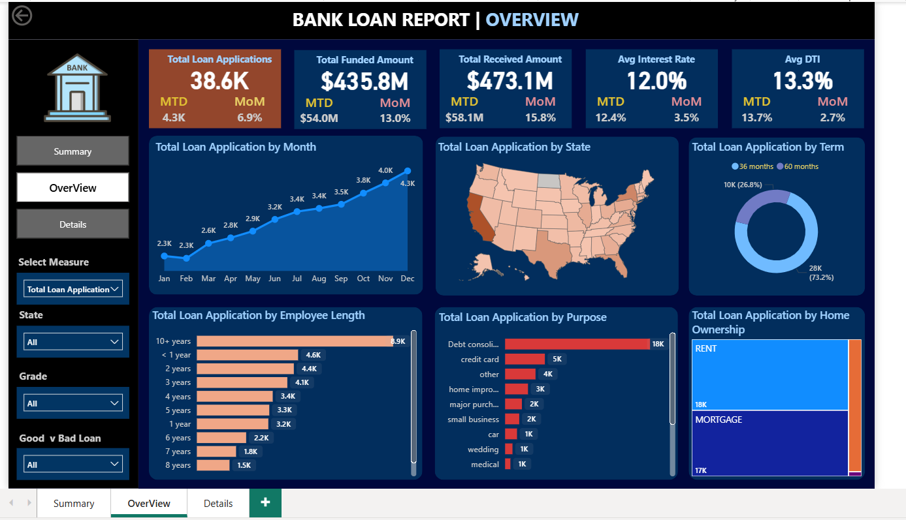
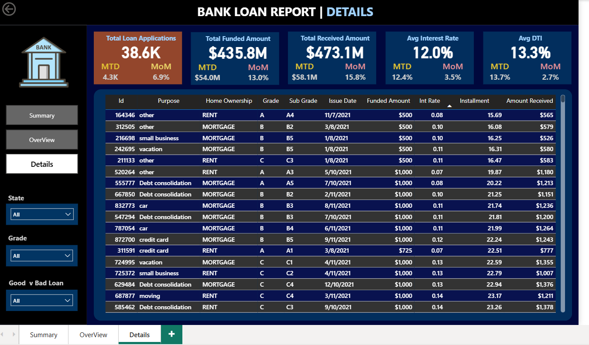

# 🏦 Bank Loan Analytics Dashboard — Power BI + SQL

An end-to-end **Bank Loan Performance Analytics** project developed using **SQL** for data processing and **Power BI** for interactive visualization.  
This project uncovers financial insights from loan data, identifies performance trends, and helps evaluate **Good vs Bad Loans** for effective decision-making.

---

##  Project Overview

The **Bank Loan Analytics Dashboard** transforms raw financial loan data into meaningful insights.  
It helps stakeholders:
- Monitor total loan applications, funded amount, and repayments  
- Track loan performance by region, category, and borrower attributes  
- Visualize **Good vs Bad Loans** and their impact  
- Explore loan details interactively with slicers and filters

This project showcases an **end-to-end analytics pipeline** — from SQL-based data aggregation to Power BI visualization.

---

##  Tools & Technologies

| Tool / Technology | Purpose |
|--------------------|----------|
| **SQL (MySQL / SQL Server)** | Data extraction, transformation, and KPI computation |
| **Power BI Desktop** | Dashboard creation and data visualization |
| **CSV Dataset** | Source data for analysis |
| **GitHub** | Project hosting and documentation |

---

##  Dataset Overview

**Dataset:** `financial_loan.csv`

| Column | Description |
|---------|-------------|
| `id` | Unique Loan ID |
| `loan_status` | Status of loan (`Fully Paid`, `Current`, `Charged Off`) |
| `loan_amount` | Amount funded to borrower |
| `total_payment` | Amount repaid by borrower |
| `int_rate` | Interest rate (%) |
| `dti` | Debt-to-income ratio |
| `purpose` | Reason for loan (car, business, etc.) |
| `emp_length` | Employment length |
| `address_state` | Borrower’s state |
| `term` | Loan duration (36 / 60 months) |
| `issue_date` | Date loan was issued |

---

##  Key Performance Indicators (KPIs)

| KPI | Value | Description |
|------|-------|-------------|
| **Total Loan Applications** | 38.6K | Total loans processed |
| **Total Funded Amount** | \$435.8M | Amount disbursed |
| **Total Amount Received** | \$473.1M | Amount repaid |
| **Average Interest Rate** | 12.0% | Mean loan interest |
| **Average DTI** | 13.3% | Average debt-to-income ratio |
| **Good Loan %** | 86.2% | Fully Paid or Current |
| **Bad Loan %** | 13.8% | Charged Off |

---

## 🖥 Power BI Dashboard Visualizations

###  1. Summary Dashboard
Provides portfolio overview, KPIs, and Good vs Bad Loan metrics.



---

###  2. Overview Dashboard
Shows loan application trends and breakdowns by month, state, purpose, and employment length.



---

###  3. Details Dashboard
Displays granular loan records with borrower-level data and performance metrics.



---
---

##  SQL Queries 

###  BANK LOAN REPORT | SUMMARY

```sql
-- Total Loan Applications
SELECT COUNT(id) AS Total_Applications FROM bank_loan_data;

-- MTD Loan Applications
SELECT COUNT(id) AS Total_Applications FROM bank_loan_data
WHERE MONTH(issue_date) = 12;

-- PMTD Loan Applications
SELECT COUNT(id) AS Total_Applications FROM bank_loan_data
WHERE MONTH(issue_date) = 11;

-- Total Funded Amount
SELECT SUM(loan_amount) AS Total_Funded_Amount FROM bank_loan_data;

-- MTD Total Funded Amount
SELECT SUM(loan_amount) AS Total_Funded_Amount FROM bank_loan_data
WHERE MONTH(issue_date) = 12;

-- PMTD Total Funded Amount
SELECT SUM(loan_amount) AS Total_Funded_Amount FROM bank_loan_data
WHERE MONTH(issue_date) = 11;

-- Total Amount Received
SELECT SUM(total_payment) AS Total_Amount_Collected FROM bank_loan_data;

-- MTD Total Amount Received
SELECT SUM(total_payment) AS Total_Amount_Collected FROM bank_loan_data
WHERE MONTH(issue_date) = 12;

-- PMTD Total Amount Received
SELECT SUM(total_payment) AS Total_Amount_Collected FROM bank_loan_data
WHERE MONTH(issue_date) = 11;

-- Average Interest Rate
SELECT AVG(int_rate)*100 AS Avg_Int_Rate FROM bank_loan_data;

-- MTD Average Interest Rate
SELECT AVG(int_rate)*100 AS MTD_Avg_Int_Rate FROM bank_loan_data
WHERE MONTH(issue_date) = 12;

-- PMTD Average Interest Rate
SELECT AVG(int_rate)*100 AS PMTD_Avg_Int_Rate FROM bank_loan_data
WHERE MONTH(issue_date) = 11;

-- Average DTI
SELECT AVG(dti)*100 AS Avg_DTI FROM bank_loan_data;

-- MTD Average DTI
SELECT AVG(dti)*100 AS MTD_Avg_DTI FROM bank_loan_data
WHERE MONTH(issue_date) = 12;

-- PMTD Average DTI
SELECT AVG(dti)*100 AS PMTD_Avg_DTI FROM bank_loan_data
WHERE MONTH(issue_date) = 11;
```

###  GOOD LOAN ISSUED
```sql
-- Good Loan Percentage
SELECT
    (COUNT(CASE WHEN loan_status IN ('Fully Paid', 'Current') THEN id END) * 100.0) /
    COUNT(id) AS Good_Loan_Percentage
FROM bank_loan_data;

-- Good Loan Applications
SELECT COUNT(id) AS Good_Loan_Applications
FROM bank_loan_data
WHERE loan_status IN ('Fully Paid', 'Current');

-- Good Loan Funded Amount
SELECT SUM(loan_amount) AS Good_Loan_Funded_Amount
FROM bank_loan_data
WHERE loan_status IN ('Fully Paid', 'Current');

-- Good Loan Amount Received
SELECT SUM(total_payment) AS Good_Loan_Amount_Received
FROM bank_loan_data
WHERE loan_status IN ('Fully Paid', 'Current');
```

### BAD LOAN ISSUED
```sql
-- Bad Loan Percentage
SELECT
    (COUNT(CASE WHEN loan_status = 'Charged Off' THEN id END) * 100.0) /
    COUNT(id) AS Bad_Loan_Percentage
FROM bank_loan_data;

-- Bad Loan Applications
SELECT COUNT(id) AS Bad_Loan_Applications
FROM bank_loan_data
WHERE loan_status = 'Charged Off';

-- Bad Loan Funded Amount
SELECT SUM(loan_amount) AS Bad_Loan_Funded_Amount
FROM bank_loan_data
WHERE loan_status = 'Charged Off';

-- Bad Loan Amount Received
SELECT SUM(total_payment) AS Bad_Loan_Amount_Received
FROM bank_loan_data
WHERE loan_status = 'Charged Off';
```

### LOAN STATUS SUMMARY
```sql
-- Loan Status Summary
SELECT
    loan_status,
    COUNT(id) AS LoanCount,
    SUM(total_payment) AS Total_Amount_Received,
    SUM(loan_amount) AS Total_Funded_Amount,
    AVG(int_rate * 100) AS Interest_Rate,
    AVG(dti * 100) AS DTI
FROM bank_loan_data
GROUP BY loan_status;

-- MTD Loan Status Summary
SELECT 
    loan_status, 
    SUM(total_payment) AS MTD_Total_Amount_Received, 
    SUM(loan_amount) AS MTD_Total_Funded_Amount 
FROM bank_loan_data
WHERE MONTH(issue_date) = 12 
GROUP BY loan_status;
```

### LOAN STATUS SUMMARY
```sql
-- Loan Status Summary
SELECT
    loan_status,
    COUNT(id) AS LoanCount,
    SUM(total_payment) AS Total_Amount_Received,
    SUM(loan_amount) AS Total_Funded_Amount,
    AVG(int_rate * 100) AS Interest_Rate,
    AVG(dti * 100) AS DTI
FROM bank_loan_data
GROUP BY loan_status;

-- MTD Loan Status Summary
SELECT 
    loan_status, 
    SUM(total_payment) AS MTD_Total_Amount_Received, 
    SUM(loan_amount) AS MTD_Total_Funded_Amount 
FROM bank_loan_data
WHERE MONTH(issue_date) = 12 
GROUP BY loan_status;
```

### BANK LOAN REPORT | OVERVIEW
```sql
-- Month-wise Loan Applications
SELECT 
    MONTH(issue_date) AS Month_Number, 
    DATENAME(MONTH, issue_date) AS Month_Name, 
    COUNT(id) AS Total_Loan_Applications,
    SUM(loan_amount) AS Total_Funded_Amount,
    SUM(total_payment) AS Total_Amount_Received
FROM bank_loan_data
GROUP BY MONTH(issue_date), DATENAME(MONTH, issue_date)
ORDER BY MONTH(issue_date);

-- State-wise Loan Applications
SELECT 
    address_state AS State, 
    COUNT(id) AS Total_Loan_Applications,
    SUM(loan_amount) AS Total_Funded_Amount,
    SUM(total_payment) AS Total_Amount_Received
FROM bank_loan_data
GROUP BY address_state
ORDER BY address_state;

-- Term-wise Loan Applications
SELECT 
    term AS Term, 
    COUNT(id) AS Total_Loan_Applications,
    SUM(loan_amount) AS Total_Funded_Amount,
    SUM(total_payment) AS Total_Amount_Received
FROM bank_loan_data
GROUP BY term
ORDER BY term;

-- Employment Length Analysis
SELECT 
    emp_length AS Employee_Length, 
    COUNT(id) AS Total_Loan_Applications,
    SUM(loan_amount) AS Total_Funded_Amount,
    SUM(total_payment) AS Total_Amount_Received
FROM bank_loan_data
GROUP BY emp_length
ORDER BY emp_length;

-- Purpose-wise Loan Applications
SELECT 
    purpose AS Purpose, 
    COUNT(id) AS Total_Loan_Applications,
    SUM(loan_amount) AS Total_Funded_Amount,
    SUM(total_payment) AS Total_Amount_Received
FROM bank_loan_data
GROUP BY purpose
ORDER BY purpose;

-- Home Ownership Analysis
SELECT 
    home_ownership AS Home_Ownership, 
    COUNT(id) AS Total_Loan_Applications,
    SUM(loan_amount) AS Total_Funded_Amount,
    SUM(total_payment) AS Total_Amount_Received
FROM bank_loan_data
GROUP BY home_ownership
ORDER BY home_ownership;
```

### FILTERED QUERY EXAMPLE
```
-- Grade A Loans by Purpose
SELECT 
    purpose AS Purpose, 
    COUNT(id) AS Total_Loan_Applications,
    SUM(loan_amount) AS Total_Funded_Amount,
    SUM(total_payment) AS Total_Amount_Received
FROM bank_loan_data
WHERE grade = 'A'
GROUP BY purpose
ORDER BY purpose;
```

 ### How to Reproduce the Project

1. Clone the repository:
```sh
git clone https://github.com/faisal-1691/bank-loan-analytics-powerbi-sql.git
```
2. Import financial_loan.csv into SQL or Power BI.

Run all queries above to generate metrics.

Open Power Bi DashBoard.pbix in Power BI Desktop.

Refresh visuals and explore dashboards interactively.

### Author

Faisal Hossain Shaown
Thank you for your interest in this project!
